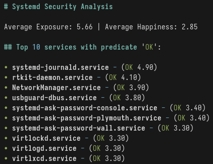

<div align="center">
    <h1>SSA</h1>
    <p align="left">
    Simple, streamlined and ✨ pretty ✨  aggregator for the security report generated by
    <code>systemd-analyze security</code>. Simply collects the data, and pretty-prints it for
    your viewing pleasure.
    </p>
    
</div>

## Usage

There are four possible arguments, two of which are mandatory:

- `--top-n` -> Number of services to list for a given predicate
- `--predicate` -> Predicate for which to aggregate services

And two optional:

- `--debug` -> Print raw JSON aggregated from `systemd-analyze security`
- `--json` -> Whether to return the aggregated results in JSON for future
  parsing

### Example:

```bash
ssa --top-n 10 --predicate UNSAFE
```

This will return the **10** services marked as **UNSAFE** in the security
report. Possible predicates are:

- `"OK"`
- `"MEDIUM"`
- `"EXPOSED"`
- `"UNSAFE"`

In addition, you will be shown the average exposure (out of 10) and the average
happiness (out of 5). In addition to displaying the top N services for a given
predicate, SSA will color the exposure level output based on how exposed it is.

## Why?

Honestly, just see the next section. Long story short is that I wanted to
aggregate the results of `systemd-analyze security` for testing and NixOS VM
tests in CI.

## Contributing

For what it's worth, SSA has been created because I wanted to write a structured
bash script for parsing the output of `systemd-analyze security`. Rust came to
mind, as Serde is pretty cool and I wanted to do argument parsing - which Clap
does better than Python libs I am familiar with.

The software is very minimal. You run it, you get a bunch of lines. You might
have cooler ideas to do with aggregated data (in which case, just take a look at
the parser) or inspect the raw JSON data yourself with `--debug` passed to the
program.

If you would like to see some other features, open either an issue or a pull
request depending on your own ability to implement the changes.

## License

SSA is licensed under the [MIT License]. See the license file for more details.
